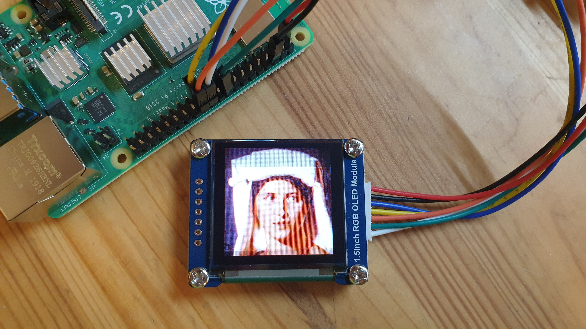

# rpi-oled-iiif-slideshow

This is a small hack for Raspberry Pi, downloading IIIF images from IIIF collections, searching for human faces and displaying them on a small 1.5" OLED display.

Video:

# additonal software in this repo:
- OLED sample code from the manufacturer Waveshare (source: https://www.waveshare.com/wiki/1.5inch_RGB_OLED_Module)
- harrcascades distributed with OpenCV
